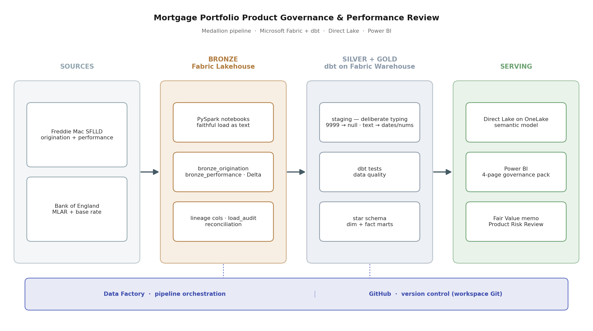
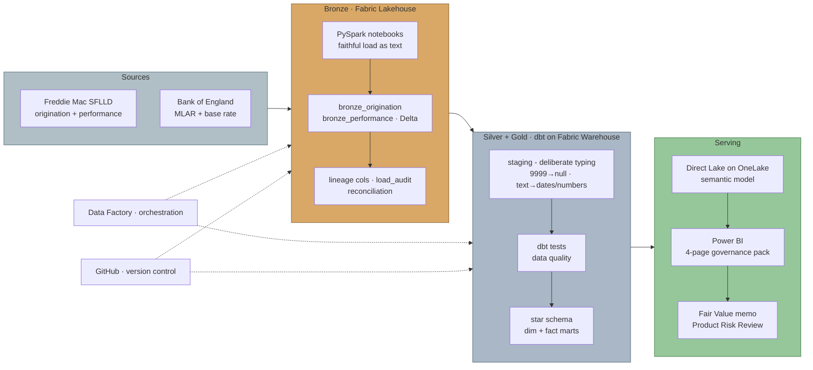
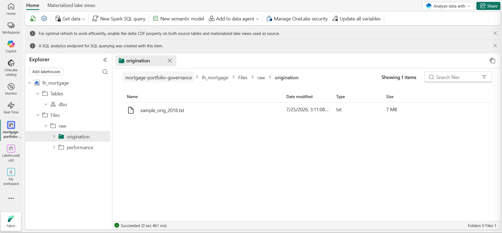
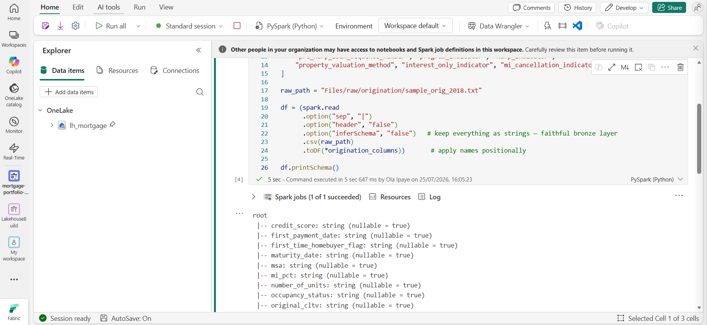
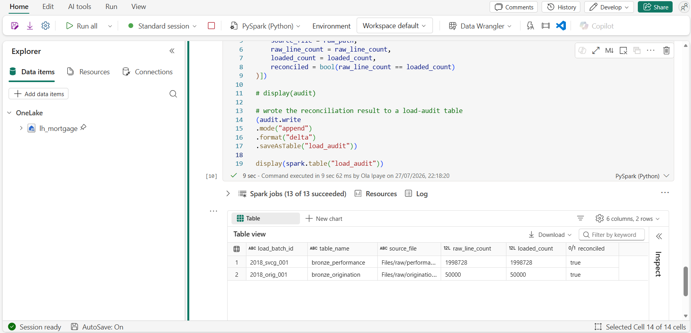
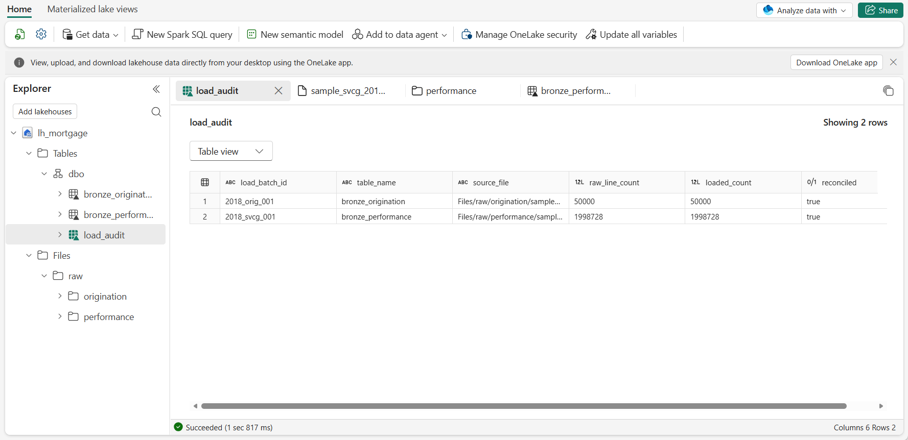
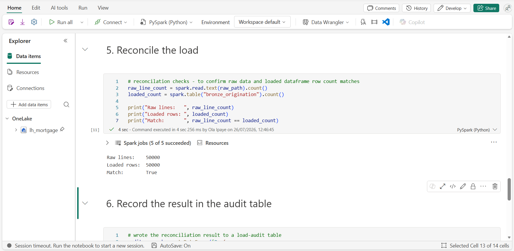
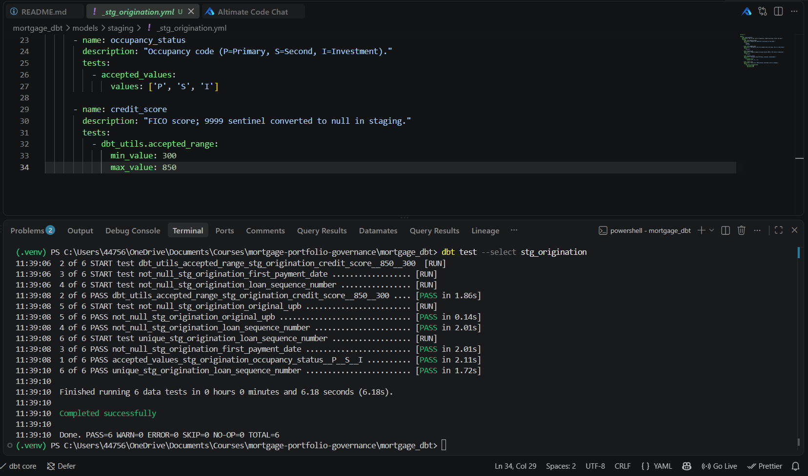

# Mortgage Portfolio Product Governance & Performance Review

An end-to-end analytics-engineering project on Microsoft Fabric. Freddie Mac
loan-level data flows through a Lakehouse, into a dbt-built star schema, and out
to a Direct Lake Power BI governance pack. Built as the quarterly governance pack
a Product Analyst at a UK lender would produce.

**Project Architecture**

## Data schema

The Freddie Mac Single-Family Loan-Level Dataset was downloaded as pipe-delimited
".txt" files with no header rows, so column names must come from Freddie
Mac's published File Layout rather than the data itself.

Freddie Mac changed the layout in July 2026, so two versions exist. I confirmed which one my 2018 sample matches by counting the columns in the raw origination file and comparing against each layout:

- Pre-July 2026 layout: 32 columns
- July 2026 layout: 31 columns
- The sample_orig_2018.txt and sample_svcg_2018.txt: **32 columns matches Pre-July 2026 layout**

The schema folder holds the column definitions derived from that confirmed
layout, one file per dataset:

- schema/origination.py - 32 fields for the Origination Data File
- schema/performance.py - 32 fields for the Monthly Performance Data File

Each file lists the columns in exact file order (order is what I relied on, since the raw files have no headers). **Columns are loaded as text at the bronze stage** to preserve the source faithfully; typing happens later in dbt.

## Bronze layer - loan-level ingestion

Two notebooks land the raw Freddie Mac files into the Lakehouse as Delta tables:

- ["notebooks/01_bronze_origination.ipynb"](notebooks/01_bronze_origination.ipynb)
  lands the origination file as "bronze_origination" (one row per loan, ~50k rows).
- ["notebooks/02_bronze_performance.ipynb"](notebooks/02_bronze_performance.ipynb)
  lands the monthly performance file as "bronze_performance" (one row per loan per
  month, ~2M rows).

The row-count difference reflects the grain of each file: origination is one row
per loan, while performance is one row per loan per reporting month.

The bronze layer follows two principles:
- **Faithful landing** - every column is read as text, so source values (including
  sentinels like "9999") are preserved exactly and typed later in dbt.
- **Auditable loads** - each row carries lineage (load batch, ingestion timestamp,
  source file), and every load is reconciled (raw line count vs loaded rows) with
  the result appended to a "load_audit" table. Both loads reconciled successfully,
  and the audit table accumulates one row per load as a running ledger.

### Pipeline evidence

**Raw ingestion into the Lakehouse**

**Column names applied from the confirmed layout**

**Load audit table - both loads reconciled**

**Reconciliation check - raw line count vs loaded rows**

## Silver / staging layer (dbt on Fabric Warehouse)

### Why this layer exists
Bronze layer holds every column as text, a faithful copy of source. Typing is
deferred to here so it's a deliberate, reviewable, *tested* decision rather than a silent cast at load time.

### How columns are typed
Every column is assigned by meaning, not appearance:
- Identifiers / codes → varchar (msa and postal_code are digits but are labels)
- Dates (YYYYMM) → date
- Whole quantities → int
- Money / rates → decimal

### Sentinels vs real zeros
Per the Freddie Mac layout, "not available" codes (e.g. 9999 credit score,
999 LTV) are converted to null before casting, so a missing value never
masquerades as a real number in an average. A real zero (000 = no MI) is
kept - it's data, not a sentinel.

### Testing
Tests turn intentions into checks:
- unique + not_null on loan_sequence_number → proves the grain (one row = one loan)
- accepted_values on coded fields → columns hold only documented codes
- accepted_range on credit_score (300–850) → proves sentinel handling worked

**All six tests green. The accepted_range test on credit_score is the proof the 9999 sentinel was fully nulled, a survivor would turn this run red.**

### Reproducing the dbt setup
The dbt connection profile isn't committed, as it points at a specific Fabric Warehouse endpoint. To run this yourself: copy `mortgage_dbt/profiles.example.yml` to `~/.dbt/profiles.yml`, set `server` to your own Warehouse SQL connection string, run `az login`, then `dbt debug` from the `mortgage_dbt/` folder.