# Mortgage Portfolio Product Governance & Performance Review

An end-to-end analytics-engineering project on Microsoft Fabric. Freddie Mac
loan-level data flows through a Lakehouse, into a dbt-built star schema, and out to a Direct Lake Power BI governance pack. Built as the quarterly governance pack a Product Analyst at a UK lender would produce.

## The Governance Pack

Four pages, one question each.

**Page 1, Portfolio Overview.** What is the position, and where is it heading?

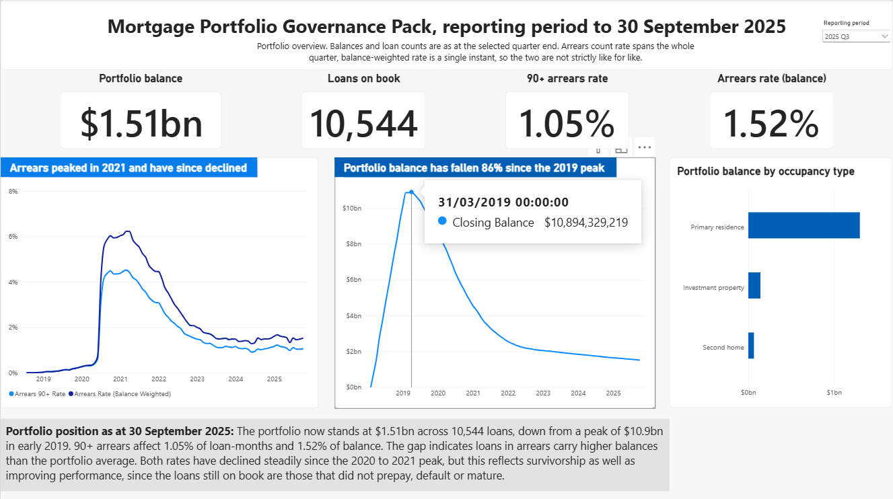

- *$1.51bn across 10,544 loans as at 30 September 2025, down from a peak of $10.89bn in March 2019. The count rate (1.05%) and the balance-weighted rate (1.52%) diverge because loans in arrears carry above-average balances. Both are reported because one tells the committee how many borrowers are affected and the other how much money is at risk.*

**Page 2, Performance and Arrears.** Is the product performing as designed for the target market?

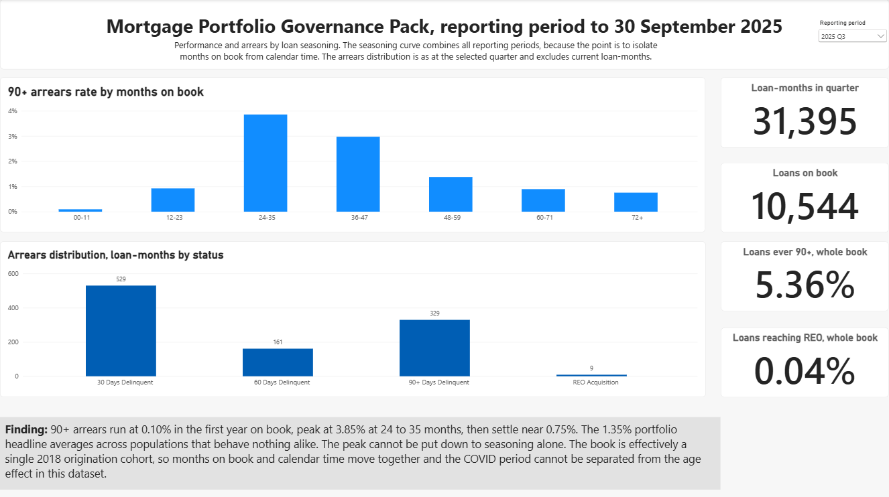

- *90+ arrears run at 0.10% in the first year on book, peak at 3.85% at 24 to 35 months, then settle near 0.75%. A roughly 40x spread around the 1.35% portfolio headline, which means any governance metric reported at portfolio level without controlling for seasoning is close to uninterpretable. The page also states the limit of the analysis: the book is effectively a single 2018 origination cohort, so months on book and calendar time are collinear and the COVID period cannot be separated from the age effect.*

**Page 3, Price and Outcome Fairness.** Are outcomes and pricing consistent across groups?

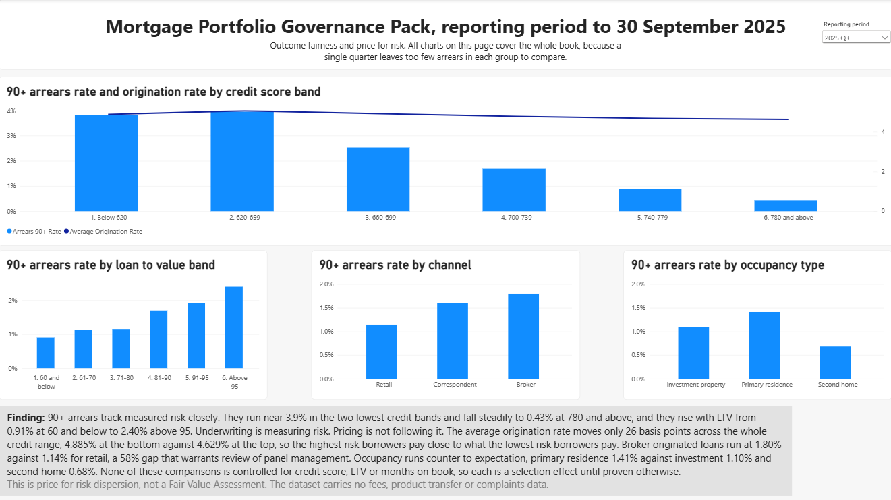

- *Arrears fall from near 3.9% in the two lowest credit bands to 0.43% at 780 and above, and rise with LTV from 0.91% to 2.40%, so underwriting is measuring risk. The average origination rate moves under half a percentage point across the same range. Price is close to flat against a risk profile that varies by an order of magnitude.*

**Page 4, Governance Summary.** What do we conclude, and what do we commit to?

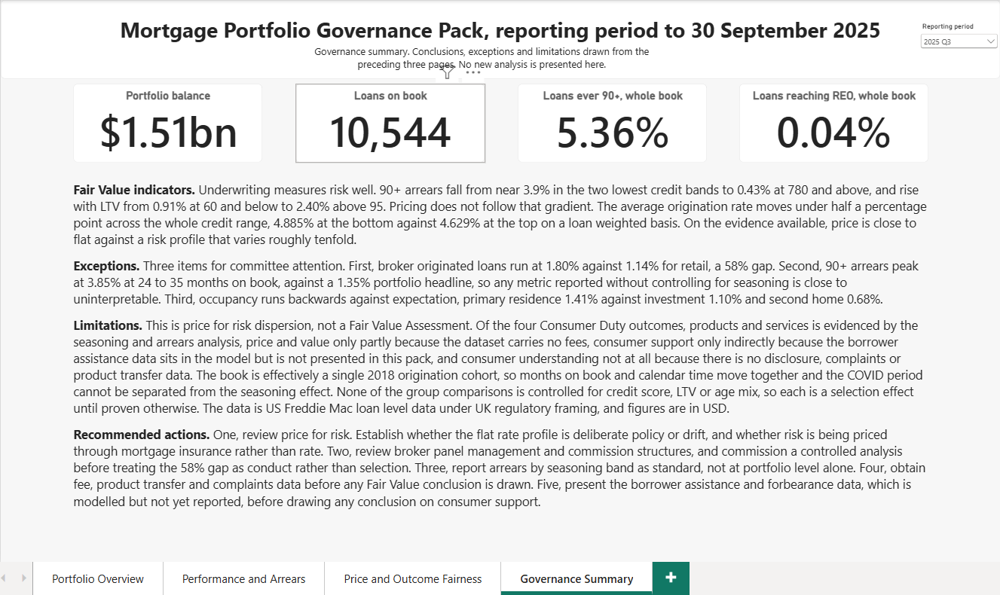

- *Conclusions, exceptions, limitations and recommended actions drawn from the preceding three pages. No new analysis. The limitations block names which Consumer Duty outcomes the dataset can and cannot evidence.*

## Semantic model

- `sem_mortgage_governance` is a Direct Lake model over three gold tables only. Staging and intermediate models are deliberately excluded. The three gold tables are for reporting purposes, while the excluded models were for implementation purposes.

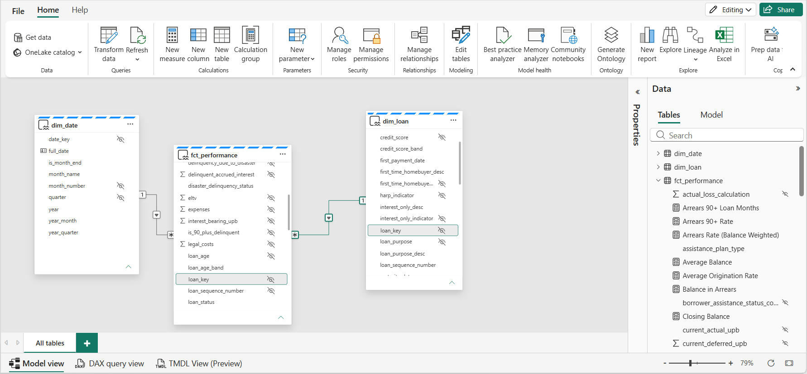

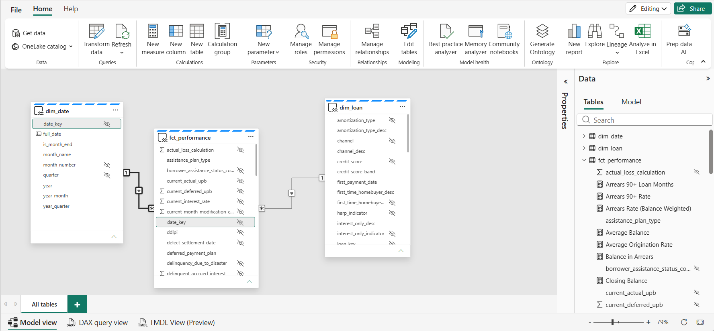

*Two relationships, many-to-one from the fact, single cross-filter direction. Bi-directional filtering is deliberately avoided because it creates ambiguous filter paths.*

Three modelling decisions worth naming:

- **`dim_date` is marked as the date table on `full_date`, not `date_key`.** Time intelligence cannot operate on an integer.
- **`month_name` is sorted by `month_number`**, and the banding columns carry numeric or zero-padded prefixes, so text columns sort in business order without a separate sort-by column. `loan_status` does use a dedicated `loan_status_sort` column, because severity order is not alphabetical.
- **Raw balance and date columns are hidden, and `current_actual_upb` is set to Summarize by: None**, so nobody can drag a raw balance onto a visual and get a figure 93 times too large. Raw code columns are hidden too, since every one now has a decoded version.

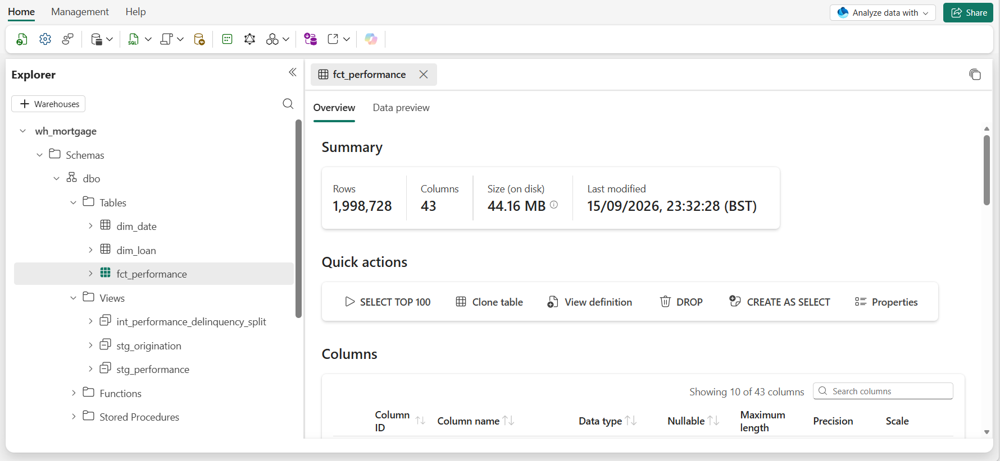

*Six dbt objects in `wh_mortgage`: staging and intermediate materialised as views, the three gold marts as tables. Materialisation is set at folder level in `dbt_project.yml`.*

## DAX measures

Fourteen measures, all filed on `fct_performance` and all reconciled against SQL before use. SQL queries can be found here: [`docs/sql/summary_findings.sql`](docs/sql/summary_findings.sql)

```
Loan Months                = COUNTROWS(fct_performance)
Loan Count                 = DISTINCTCOUNT(fct_performance[loan_sequence_number])
Closing Balance            = CALCULATE(SUM(fct_performance[current_actual_upb]), LASTDATE(dim_date[full_date]))
Average Balance            = AVERAGEX(VALUES(dim_date[year_month]), CALCULATE(SUM(fct_performance[current_actual_upb])))
Arrears 90+ Loan Months    = CALCULATE(COUNTROWS(fct_performance), fct_performance[is_90_plus_delinquent] = TRUE())
Arrears 90+ Rate           = DIVIDE([Arrears 90+ Loan Months], [Loan Months])
Loans Ever 90+             = CALCULATE(DISTINCTCOUNT(fct_performance[loan_sequence_number]), fct_performance[is_90_plus_delinquent] = TRUE())
Pct Loans Ever 90+         = DIVIDE([Loans Ever 90+], [Loan Count])
Loans Ever REO             = CALCULATE(DISTINCTCOUNT(fct_performance[loan_sequence_number]), fct_performance[loan_status] = "REO Acquisition")
Pct of Loans Ever REO      = DIVIDE([Loans Ever REO], [Loan Count])
Balance in Arrears         = CALCULATE([Closing Balance], fct_performance[is_90_plus_delinquent] = TRUE())
Arrears Rate (Bal Wtd)     = DIVIDE([Balance in Arrears], [Closing Balance])
Average Origination Rate   = AVERAGE(dim_loan[original_interest_rate])
Report Period              = "Mortgage Portfolio Governance Pack, reporting period to " & FORMAT(LASTDATE(dim_date[full_date]), "d MMMM yyyy")
```

Reconciled unfiltered against the warehouse: 1,998,728 loan-months, 50,000 loans, 26,949 arrears loan-months, 1.35% arrears rate, 2,681 loans ever 90+, 5.36%. All exact matches to the SQL queries in [`docs/sql/summary_findings.sql`](docs/sql/summary_findings.sql).

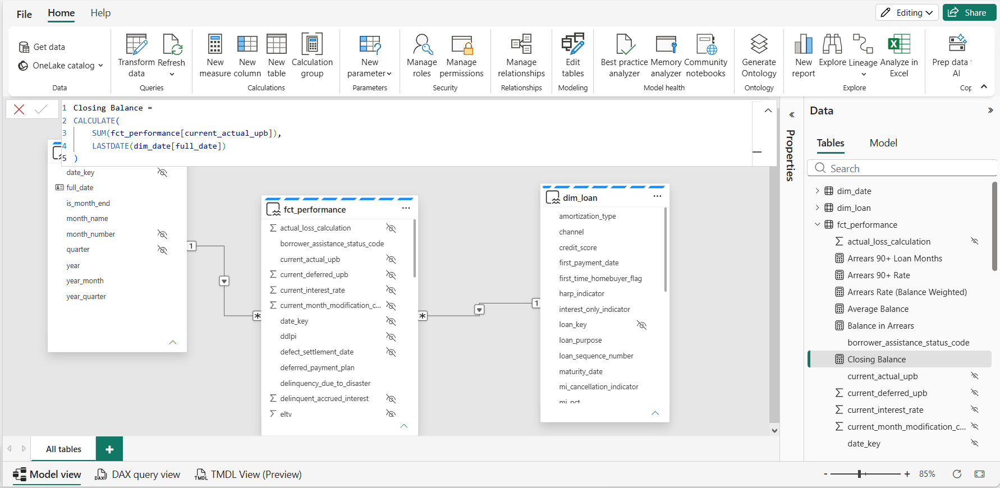

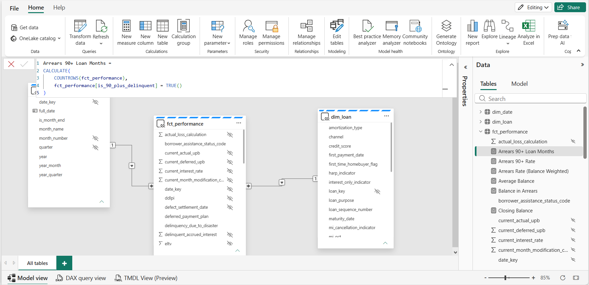

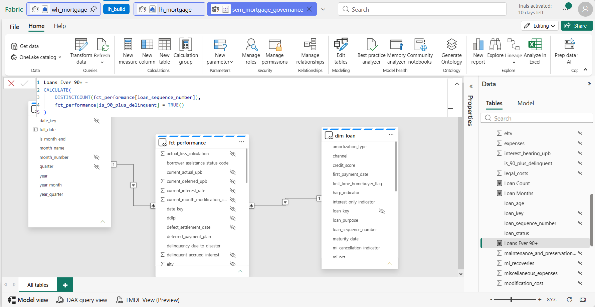

Three principles drove the measure design:

- **Stocks versus flows.** Balances are photographs of an instant, semi-additive, so they sum across loans but never across time. Losses happened during a period and are fully additive. Rates are non-additive and must always be recomputed from numerator and denominator, which is exactly why they are measures and not stored columns.
- **A periodic snapshot fact is naturally full of stocks**, so semi-additivity was guaranteed the moment that fact table design was chosen. `Closing Balance` uses `LASTDATE` for that reason.
- **Measures are evaluated fresh in every cell**, against that cell's filter context. That is why one ratio measure gives the right answer at monthly, quarterly and annual grain without writing three versions.

**A MS Fabric limitation worth noting:** SQL `bit` data type becomes Boolean in the semantic model, so `SUM` on a bit column throws error "The function SUM cannot work with values of type Boolean". So the arrears measures use `CALCULATE(COUNTROWS(...), [flag] = TRUE())` instead.

## Key Findings

1. **Portfolio position as at 30 September 2025.** $1.51bn across 10,544 loans, down from a peak of $10,894,329,219 in March 2019. An 86% fall in balance against 79% in loan count. The gap between those two percentages says the loans that left were larger than those remaining, consistent with the 2020 to 2021 refinancing wave.

2. **Count rate and balance rate diverge.** 1.05% of loan-months against 1.52% of balance. Loans in arrears carry balances well above the portfolio average. Basis caveat: the count rate spans the quarter, the balance rate pins to `LASTDATE`, so it is a single instant. Not strictly like for like, and the governance pack labels it rather than forcing them to match.

3. **Seasoning dominates the headline.** 90+ arrears run at 0.10% at 0 to 11 months on book, peak at 3.85% at 24 to 35 months, and decline to 0.75% beyond 72 months. A roughly 40x spread around the 1.35% headline.

4. **The peak cannot be attributed to seasoning alone.** Borrower assistance rose from a ~0.05% baseline in 2018 and 2019 to 4.02% and 4.26% of loan-months in 2020 and 2021, with disaster coding accounting for nearly all of it. Because the book is effectively a single 2018 origination cohort (42,198 loans first-paying in 2018, 7,792 in 2019, 10 after), months-on-book and calendar time are collinear and the two effects cannot be separated within this dataset. Stating that limit is the finding.

5. **Price is close to flat against risk.** Arrears fall from near 3.9% in the two lowest credit bands to 0.43% at 780 and above, roughly a ninefold difference, while the average origination rate moves under half a percentage point across the same range. The rate is also not consistently ordered by credit band at the bottom of the book, though the lowest band holds only 87 loans and is too thin to interpret alone.

6. **Broker originated loans run 58% above retail.** 1.80% against 1.14%, with correspondent at 1.60% in between. Denominators are large (181,792 broker loan-months), so this is not a small-sample artifact. Not controlled for credit score, LTV or age mix, so it remains a selection effect until proven otherwise.

7. **Occupancy ordering is counterintuitive and still unexplained.** Primary residence 1.41%, investment 1.10%, second home 0.68%. The usual assumption is that a borrower defends the home they live in first. Flagged honestly as needing segmentation by credit score, LTV and age band rather than explained away. Live hypothesis is underwriting selection: US investment property lending requires larger deposits, higher scores and cash reserves, so occupancy may be proxying for borrower affluence rather than measuring behaviour. The denominator is solid (193,473 investment loan-months).

8. **Loan-level severity.** 5.4% of loans (2,681 of 50,000) ever hit 90+, only 0.04% (18 loans) reached REO. Most arrears resolve before repossession.

## Scope, framing and what this is not

**US data under UK framing.** The pack applies UK regulatory concepts (Consumer Duty, Fair Value, arrears governance) to US Freddie Mac loan-level data, because no comparable UK loan-level dataset is publicly available. **All figures are in USD, not GBP.** Some regulatory concepts do not transfer cleanly: UK buy-to-let is a different product under different rules from US investor lending, so the occupancy analysis is not a buy-to-let analysis.

**This is price for risk dispersion, not a Fair Value Assessment.** Freddie Mac provides rates, LTV, DTI, credit score and channel. It provides no fees, no product transfer data and no complaints. Of the four Consumer Duty outcomes, products and services is evidenced here, price and value only partly, consumer support only indirectly (the borrower assistance data is modelled but not presented in the pack), and consumer understanding not at all.

**Selection versus behaviour.** A difference between groups is a selection effect until proven otherwise. That applies to occupancy, to channel, to the age bands (loans leave the book non-randomly), and to the late-book arrears decline.

**Project Architecture**
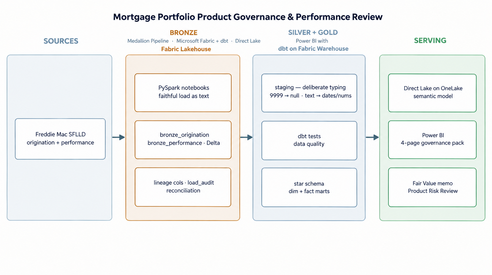

## Data schema

The Freddie Mac Single-Family Loan-Level Dataset was downloaded as pipe-delimited
".txt" files with no header rows, so column names must come from Freddie
Mac's published File Layout rather than the data itself.

Freddie Mac changed the layout in July 2026, so two versions exist. I confirmed which one my 2018 sample matches by counting the columns in the raw origination file and comparing against each layout:

- Pre-July 2026 layout: 32 columns
- July 2026 layout: 31 columns
- The sample_orig_2018.txt and sample_svcg_2018.txt: **32 columns matches Pre-July 2026 layout**

The schema folder holds the column definitions derived from that confirmed
layout, one file per dataset:

- schema/origination.py - 32 fields for the Origination Data File
- schema/performance.py - 32 fields for the Monthly Performance Data File

Each file lists the columns in exact file order (order is what I relied on, since the raw files have no headers). **Columns are loaded as text at the bronze stage** to preserve the source faithfully; typing happens later in dbt.

## Bronze layer - loan-level ingestion

Two notebooks land the raw Freddie Mac files into the Lakehouse as Delta tables:

- ["notebooks/01_bronze_origination.ipynb"](notebooks/01_bronze_origination.ipynb)
  lands the origination file as "bronze_origination" (one row per loan, ~50k rows).
- ["notebooks/02_bronze_performance.ipynb"](notebooks/02_bronze_performance.ipynb)
  lands the monthly performance file as "bronze_performance" (one row per loan per
  month, ~2M rows).

The row-count difference reflects the grain of each file: origination is one row
per loan, while performance is one row per loan per reporting month.

The bronze layer follows two principles:
- **Faithful landing** - every column is read as text, so source values (including
  sentinels like "9999") are preserved exactly and typed later in dbt.
- **Auditable loads** - each row carries lineage (load batch, ingestion timestamp,
  source file), and every load is reconciled (raw line count vs loaded rows) with
  the result appended to a "load_audit" table. Both loads reconciled successfully,
  and the audit table accumulates one row per load as a running ledger.

### Pipeline evidence

**Raw ingestion into the Lakehouse**


**Column names applied from the confirmed layout**


**Load audit table - both loads reconciled**


**Reconciliation check - raw line count vs loaded rows**


## Silver / staging layer (dbt on Fabric Warehouse)

Two staging models - one per bronze table, each one-to-one with its source, so the
grain is unchanged (origination table stays one row per loan; performance table stays one row
per loan-month). Their only job is to turn faithful-but-untyped bronze text into
correctly-typed, meaningful columns, and to prove those decisions with tests. dbt
runs in the Warehouse (`wh_mortgage`) and reads bronze live from the Lakehouse
(`lh_mortgage`) via Fabric cross-database three-part naming - zero-copy, declared
once in `_sources.yml`.

### Why this layer exists
Bronze holds every column as text - a faithful copy of source. Typing is deferred
to here so it's a deliberate, reviewable, *tested* decision rather than a silent
cast at load time. That means a source sentinel like `9999` can never quietly
become a real number, and leading zeros are never lost by accident.

### How columns are typed - meaning, not appearance
Every column is assigned to one of four buckets by what it *means*, not what it
looks like:
- **Identifiers / codes → `varchar`** - including numeric-looking labels like
  `msa`, `postal_code`, `zero_balance_code`, and `property_valuation_method`. You
  never do arithmetic on these, and casting them to numbers would strip meaningful
  leading zeros.
- **Dates (YYYYMM) → `date`** - via a `+ '01'` cast to the first of the month.
- **Whole-number quantities → `int`** - counts and terms you'd average or band.
- **Money / rates → `decimal`** - sized by *profiling* the data, not guessing.

Two subtleties that drive the calls:
- **Zero-padding does not force text.** A padded *count* like `054` months is still
  a quantity → `int`. Only a genuine non-numeric value (e.g. `RA`) or a code whose
  leading zero is part of its identity (e.g. `01`) forces `varchar`.
- **Decimals are sized by profiling, not assumption.** Precision/scale are set from
  a `MIN`/`MAX` query against the real column, because `try_cast` silently returns
  `null` on overflow - an undersized decimal would quietly delete the largest values
  (exactly the loans a loss analysis most needs). Signed money fields are profiled at
  *both* ends: for escrow fields the sign is information (negative = disbursed,
  positive = refund), so it's preserved, never `ABS()`-ed.

### `cast` vs `try_cast` - assert vs tolerate
The choice encodes how much a column is trusted:
- **Keys / identifiers use `cast`** - assert the format and *fail loudly* if it's
  wrong. A silently-nulled or truncated join key is catastrophic (nulls don't join,
  so rows vanish with no error), so on `loan_sequence_number` a hard `cast` is a
  deliberate tripwire.
- **Descriptive payload uses `try_cast`** - tolerate real-world mess by turning a
  bad value into `null`, then catch it with tests rather than crashing the run.

### Sentinels vs real zeros
Per the Freddie Mac layout, documented "not available" codes are converted to `null`
*before* casting, per column (e.g. `9999` credit score, `999` for LTV / CLTV / DTI /
ELTV), so a missing value never masquerades as a real number in an average. This is
done from the **published data dictionary, not the sample** - a value absent in the
2018 file may still be a defined sentinel, so the model codes to the spec. Crucially,
a **real zero is not a sentinel**: `000` = no mortgage insurance and `0.00` = a real
recovery are kept as data. Nulling them would erase an entire legitimate population
and silently corrupt any average.

### Delinquency status - the analytical backbone
`current_loan_delinquency_status` is kept as `varchar(3)`, and it's the most
important field in the project. It's an MBA-method code where each integer is a
30-day band (`0` = current, `1` = 30–59 days, `2` = 60–89, `3` = 90–119, up to ~`70`)
plus `RA` = REO acquisition. Two reasons it stays text: the `RA` code would be lost
by a numeric cast (nulling exactly the distressed loans an arrears analysis needs),
and the field is overloaded - part quantity, part status. It's preserved faithfully
here and split downstream in gold into a numeric `months_delinquent` and a
categorical `loan_status`. The governance "90+ days delinquent" threshold maps to
**status ≥ 3**.

### Testing - claims worth proving, sized to risk
Tests assert specific failure modes, not coverage for its own sake - each one below
names the risk it guards against.

**stg_origination** (grain: one loan)
- `unique` + `not_null` on `loan_sequence_number` - proves the grain (one row = one loan).
- `not_null` on structurally-required fields - catches a `try_cast` that silently nulled a value that should always parse.
- `accepted_values` on `occupancy_status` - the column only ever holds documented codes.
- `dbt_utils.accepted_range` (300–850) on `credit_score` - proves the `9999` sentinel was fully nulled; a survivor turns this red.

**stg_performance** (grain: one loan per reporting month)
- `dbt_utils.unique_combination_of_columns` on (`loan_sequence_number`, `monthly_reporting_period`) - proves the composite loan-month grain over ~2M rows.
- `not_null` on both key columns and on the delinquency status.
- `relationships` to `stg_origination` - proves referential integrity: every one of the ~2M performance rows traces back to a real originated loan (zero orphans), so the origination-to-performance join can't silently drop or duplicate rows.

The single-key and composite-key tests prove each table's grain; the `relationships`
test proves the two are structurally sound to join - the foundation the gold star
schema is built on.


*stg_origination: all six tests green. The `accepted_range` test on `credit_score`
is the proof the `9999` sentinel was fully nulled - a survivor would turn this red.*


*stg_performance: `composite grain` and `referential integrity` to origination, both green.*

## Intermediate + Gold layer (dbt on Fabric Warehouse)

### Intermediate - splitting the delinquency status

- `current_loan_delinquency_status` is overloaded: part numeric quantity, part
categorical status (including the `RA` = REO code, which can't survive a numeric
cast).
- `int_performance_delinquency_split` resolves this by deriving two columns
from it - `months_delinquent` (int, via `try_cast`, `null` for REO) and `loan_status`
(varchar, a `CASE` mapping every band into a label, with `90+ Days Delinquent`
covering the governance threshold and everything above it). Grain is unchanged from
`stg_performance` (one row per loan per reporting month); every original column is
carried through for traceability.


*months_delinquent (int) and loan_status (varchar) derived as separate columns from
the overloaded current_loan_delinquency_status field.*

### Decoding the source codes

Freddie Mac ships most categorical fields as single-character codes. Those are decoded
into readable labels in dbt rather than in Power BI, with the raw code kept alongside
each decode for traceability, because a governance committee should never be shown a
column of P, I and S.

Every `CASE` was written against the published layout spec, not against the values
present in this extract. That caught five errors in the process:

- `loan_purpose` permits five values, not the three present here. Coding to the sample
  would have silently dumped "refinance, not specified" loans into an Unknown bucket on
  the page whose job is showing that no group is treated differently.
- `super_conforming_flag` and the relief refinance flag are Y or blank, not Y/N. Treating
  them as Y/N would have mislabelled 95%+ of the book as missing data.
- `mi_cancellation_indicator` has four states, and codes 7 and 9 are meaningfully
  distinct (no MI ever existed, versus not disclosed).
- The column inherited as `harp_indicator` is the **Relief Refinance Indicator**. HARP
  loans are the subset with original LTV above 80, so the decode is named
  `relief_refinance_desc` and the pack does not claim it identifies HARP.
- `property_valuation_method` code 4 (ACE+ PDR) applies only to originations from 17
  July 2022, so it cannot appear on a 2018 book. It is still coded, because the rule is
  code to the spec, not the sample.

Three fields on the performance side use `NULL` as a *meaningful* value:
`modification_flag`, `delinquency_due_to_disaster` and `borrower_assistance_status_code`.
A simple `CASE x WHEN NULL` never matches, so those use searched `CASE` expressions with
an explicit `IS NULL` branch. This matters most for borrower assistance, where `NULL`
means "no workout plan", a confirmed state. Labelling it Unknown would have made the page
say the opposite of what the data says.

Banding columns (`loan_age_band`, `credit_score_band`, `original_ltv_band`) live in dbt
rather than Power BI because band definitions are business logic: they belong in version
control, they are testable, and they guarantee the visual reconciles against the saved
SQL. Boundaries were set after checking the actual distributions, so no band holds most
of the book. `loan_age_band` uses exactly the boundaries of query C2 in
`summary_findings.sql`.

Every decoded column carries `not_null` and `accepted_values` tests against the full
documented value set plus an Unknown catch-all. The `not_null` does real work here:
`accepted_values` compares with `NOT IN`, which returns unknown against `NULL` and passes
silently, so it cannot on its own detect a column that failed to build. The project
carries 82 data tests, all passing.

### Gold - dim_loan

- `dim_loan` is a Type 1 conformed dimension built from `stg_origination`: one row
per loan, fixed origination attributes (no history needed, since none of these
values legitimately change after the loan is written). A surrogate key
(`loan_key`, integer, via `ROW_NUMBER() OVER (ORDER BY loan_sequence_number)`) is
generated for downstream joins, in place of the natural key - cheaper to join and
index than the `varchar` `loan_sequence_number`, which is kept on the table for
traceability only.

Six low-cardinality flags are kept as direct columns rather than collapsed into a junk
dimension. That was considered and rejected given the scale of this project.


*50,000 rows, one per loan, confirming the grain matches the origination sample.*


*unique + not_null on both loan_key and loan_sequence_number, passing - the highest-stakes
test in this model, since a broken surrogate key would silently corrupt every join
to fct_performance.*

### Gold - fct_performance

- `fct_performance` is a periodic snapshot fact table: one row per loan per reporting
month, joined to `dim_loan` on `loan_sequence_number` to inherit `loan_key` as the
foreign key (the join happens once at build time, not on every downstream query and 
every report afterward joins on the integer key). Carries `months_delinquent`
and `loan_status` from the intermediate layer, plus every additive measure (UPB,
recoveries, expenses, losses) and non-additive descriptive attribute (modification
flag, zero balance code) from the source performance file, all at the same
loan-month grain.

A derived `is_90_plus_delinquent` flag (`bit`) marks the governance threshold
explicitly: `months_delinquent >= 3` is `1`, everything else - including REO loans,
where `months_delinquent` is `null` - is deliberately cast to `0`. That is an
interpretive call: `NULL >= 3` evaluates to unknown in SQL rather than false, and REO is
a terminal status, not active 90+ arrears.

`fct_performance` also carries `snapshot_month_end` and `date_key`, aligned to **month
end**, not the 1st. A date column can mean "when" or "which period":
`monthly_reporting_period` is a label for a month that happens to be stored as the 1st,
while `snapshot_month_end` is the instant the row describes. Month-end alignment is both
what `LASTDATE` needs and what the source data actually means.

### Gold - dim_date

`dim_date` is a conformed date dimension, **generated rather than sourced**, so it
contains no `ref()` or `source()`. 2,922 daily rows covering 2018-01-01 to 2025-12-31,
whole calendar years, 96 month-ends.

The date spine is produced by cross-joining a ten-row digits CTE four times with
place-value weighting, producing integers 0 to 9999 from nothing, then `DATEADD` onto an
anchor date. Recursive CTEs would be the obvious approach, but Fabric's support for them
is patchy, and the project had already been bitten twice by Fabric strictness.

**A referential integrity test proves a key is valid, not that it is correct.** Both
`20180101` and `20180131` exist in `dim_date`, so the fact-to-date relationship test
passes either way. Only eyeballing the join catches the wrong one, which is why query B3
exists in `summary_findings.sql`.

Summary Findings queries validating row counts, arrears distribution, referential integrity, seasoning, vintage, forbearance, and the outcome fairness results are in
[`docs/sql/summary_findings.sql`](docs/sql/summary_findings.sql).

## Fabric compatibility notes

Everything below was hit for real during the build and cost time to diagnose.

- **`dbt_utils.expression_is_true` fails on Fabric with error 8155.** The unaliased `select 1` it generates breaks Fabric's stricter engine. Replaced with a singular test using aliased columns.
- **`datename()` returns `nvarchar(30)`, which Fabric Warehouse cannot persist as a column type.** Cast to `varchar`. Note the failure happens at table creation, not query time: Fabric will evaluate expressions it will not let you store.
- **`information_schema.columns` unqualified gives "Invalid object name" in the Fabric SQL editor.** Use `sys.columns` joined to `sys.types` instead.
- **Positional `GROUP BY` is not supported** ("Each GROUP BY expression must contain at least one column that is not an outer reference"), though positional `ORDER BY` is. Wrap the expression in a CTE and group by the alias.
- **Azure auth expiry surfaces as connection errors** (TCP timeout, login timeout, server not found), not data errors. A real test failure reports a row count of failing records. If the driver is talking, dbt never reached the test logic.
- **Axis min and max in Power BI are set against the stored value, not the display.** A percentage-formatted measure holding 0.08 needs a max of 0.08, not 8.
- **Direct Lake propagates data automatically but not structure.** Every dbt schema change needs a manual Edit tables refresh in the semantic model, and re-adding a table can drop its relationship.

### Reproducing the dbt setup
The dbt connection profile isn't committed, as it points at a specific Fabric Warehouse endpoint. To run this yourself: copy `mortgage_dbt/profiles.example.yml` to `~/.dbt/profiles.yml`, set `server` to your own Warehouse SQL connection string, run `az login`, then `dbt debug` from the `mortgage_dbt/` folder.