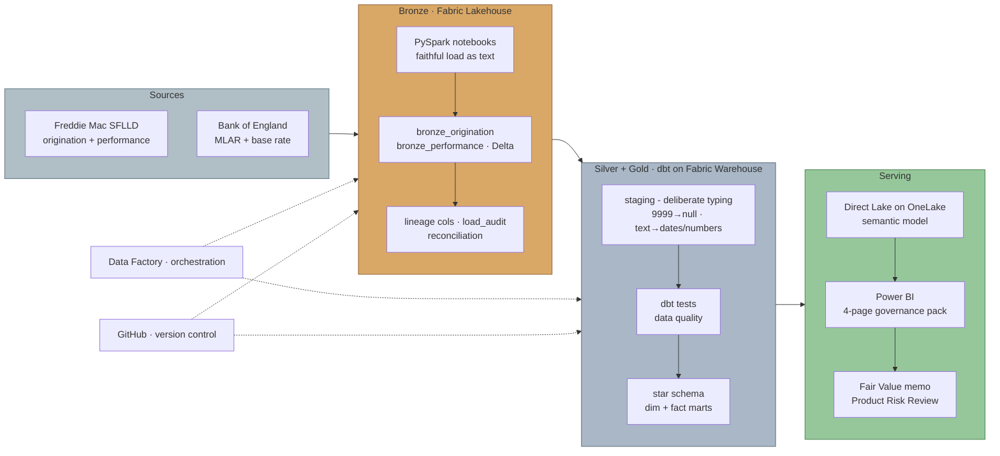
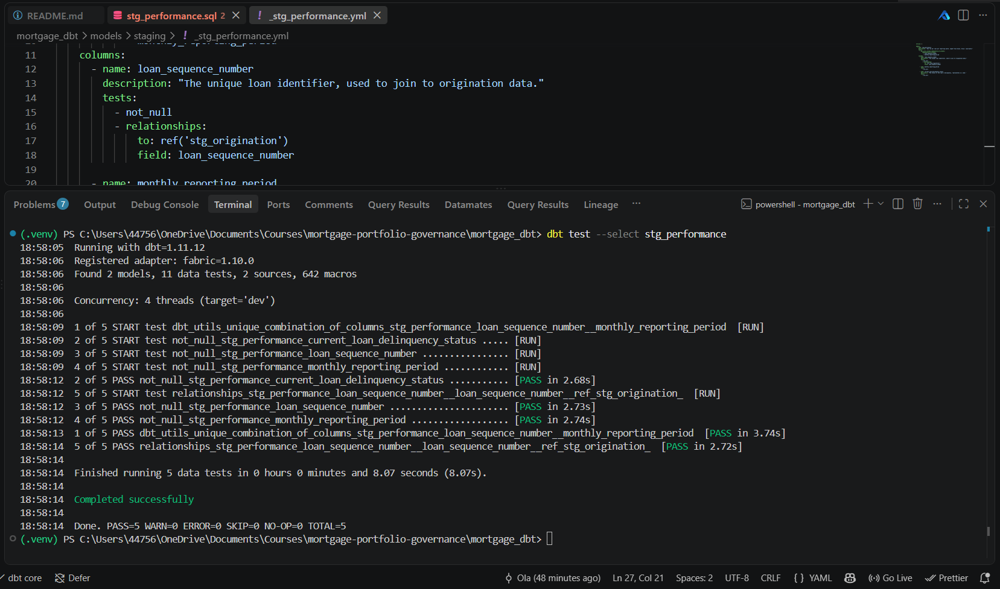
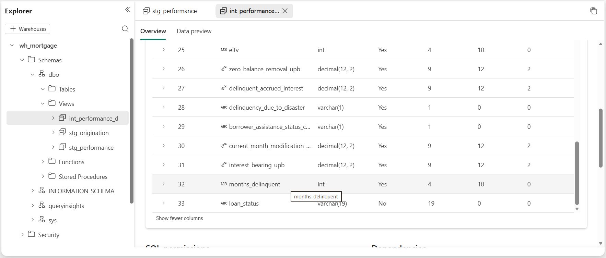
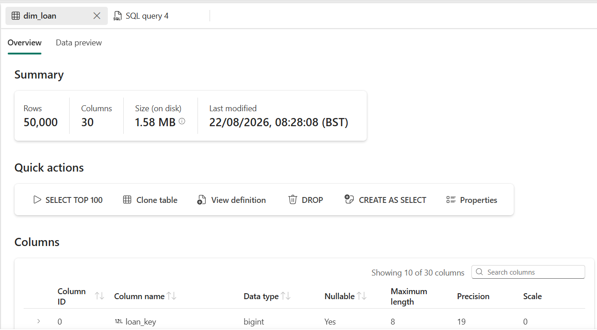
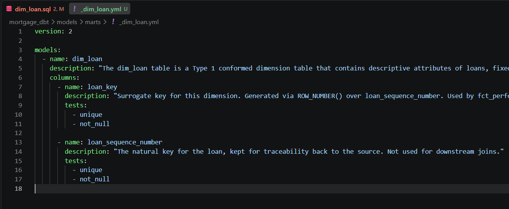

# Mortgage Portfolio Product Governance & Performance Review

An end-to-end analytics-engineering project on Microsoft Fabric. Freddie Mac
loan-level data flows through a Lakehouse, into a dbt-built star schema, and out
to a Direct Lake Power BI governance pack. Built as the quarterly governance pack
a Product Analyst at a UK lender would produce.

**Project Architecture**

## Data schema

The Freddie Mac Single-Family Loan-Level Dataset was downloaded as pipe-delimited
".txt" files with no header rows, so column names must come from Freddie
Mac's published File Layout rather than the data itself.

Freddie Mac changed the layout in July 2026, so two versions exist. I confirmed which one my 2018 sample matches by counting the columns in the raw origination file and comparing against each layout:

- Pre-July 2026 layout: 32 columns
- July 2026 layout: 31 columns
- The sample_orig_2018.txt and sample_svcg_2018.txt: **32 columns matches Pre-July 2026 layout**

The schema folder holds the column definitions derived from that confirmed
layout, one file per dataset:

- schema/origination.py - 32 fields for the Origination Data File
- schema/performance.py - 32 fields for the Monthly Performance Data File

Each file lists the columns in exact file order (order is what I relied on, since the raw files have no headers). **Columns are loaded as text at the bronze stage** to preserve the source faithfully; typing happens later in dbt.

## Bronze layer - loan-level ingestion

Two notebooks land the raw Freddie Mac files into the Lakehouse as Delta tables:

- ["notebooks/01_bronze_origination.ipynb"](notebooks/01_bronze_origination.ipynb)
  lands the origination file as "bronze_origination" (one row per loan, ~50k rows).
- ["notebooks/02_bronze_performance.ipynb"](notebooks/02_bronze_performance.ipynb)
  lands the monthly performance file as "bronze_performance" (one row per loan per
  month, ~2M rows).

The row-count difference reflects the grain of each file: origination is one row
per loan, while performance is one row per loan per reporting month.

The bronze layer follows two principles:
- **Faithful landing** - every column is read as text, so source values (including
  sentinels like "9999") are preserved exactly and typed later in dbt.
- **Auditable loads** - each row carries lineage (load batch, ingestion timestamp,
  source file), and every load is reconciled (raw line count vs loaded rows) with
  the result appended to a "load_audit" table. Both loads reconciled successfully,
  and the audit table accumulates one row per load as a running ledger.

### Pipeline evidence

**Raw ingestion into the Lakehouse**

**Column names applied from the confirmed layout**

**Load audit table - both loads reconciled**

**Reconciliation check - raw line count vs loaded rows**

## Silver / staging layer (dbt on Fabric Warehouse)

Two staging models - one per bronze table, each one-to-one with its source, so the
grain is unchanged (origination table stays one row per loan; performance table stays one row
per loan-month). Their only job is to turn faithful-but-untyped bronze text into
correctly-typed, meaningful columns, and to prove those decisions with tests. dbt
runs in the Warehouse (`wh_mortgage`) and reads bronze live from the Lakehouse
(`lh_mortgage`) via Fabric cross-database three-part naming - zero-copy, declared
once in `_sources.yml`.

### Why this layer exists
Bronze holds every column as text - a faithful copy of source. Typing is deferred
to here so it's a deliberate, reviewable, *tested* decision rather than a silent
cast at load time. That means a source sentinel like `9999` can never quietly
become a real number, and leading zeros are never lost by accident.

### How columns are typed - meaning, not appearance
Every column is assigned to one of four buckets by what it *means*, not what it
looks like:
- **Identifiers / codes → `varchar`** - including numeric-looking labels like
  `msa`, `postal_code`, `zero_balance_code`, and `property_valuation_method`. You
  never do arithmetic on these, and casting them to numbers would strip meaningful
  leading zeros.
- **Dates (YYYYMM) → `date`** - via a `+ '01'` cast to the first of the month.
- **Whole-number quantities → `int`** - counts and terms you'd average or band.
- **Money / rates → `decimal`** - sized by *profiling* the data, not guessing.

Two subtleties that drive the calls:
- **Zero-padding does not force text.** A padded *count* like `054` months is still
  a quantity → `int`. Only a genuine non-numeric value (e.g. `RA`) or a code whose
  leading zero is part of its identity (e.g. `01`) forces `varchar`.
- **Decimals are sized by profiling, not assumption.** Precision/scale are set from
  a `MIN`/`MAX` query against the real column, because `try_cast` silently returns
  `null` on overflow - an undersized decimal would quietly delete the largest values
  (exactly the loans a loss analysis most needs). Signed money fields are profiled at
  *both* ends: for escrow fields the sign is information (negative = disbursed,
  positive = refund), so it's preserved, never `ABS()`-ed.

### `cast` vs `try_cast` - assert vs tolerate
The choice encodes how much a column is trusted:
- **Keys / identifiers use `cast`** - assert the format and *fail loudly* if it's
  wrong. A silently-nulled or truncated join key is catastrophic (nulls don't join,
  so rows vanish with no error), so on `loan_sequence_number` a hard `cast` is a
  deliberate tripwire.
- **Descriptive payload uses `try_cast`** - tolerate real-world mess by turning a
  bad value into `null`, then catch it with tests rather than crashing the run.

### Sentinels vs real zeros
Per the Freddie Mac layout, documented "not available" codes are converted to `null`
*before* casting, per column (e.g. `9999` credit score, `999` for LTV / CLTV / DTI /
ELTV), so a missing value never masquerades as a real number in an average. This is
done from the **published data dictionary, not the sample** - a value absent in the
2018 file may still be a defined sentinel, so the model codes to the spec. Crucially,
a **real zero is not a sentinel**: `000` = no mortgage insurance and `0.00` = a real
recovery are kept as data. Nulling them would erase an entire legitimate population
and silently corrupt any average.

### Delinquency status - the analytical backbone
`current_loan_delinquency_status` is kept as `varchar(3)`, and it's the most
important field in the project. It's an MBA-method code where each integer is a
30-day band (`0` = current, `1` = 30–59 days, `2` = 60–89, `3` = 90–119, up to ~`70`)
plus `RA` = REO acquisition. Two reasons it stays text: the `RA` code would be lost
by a numeric cast (nulling exactly the distressed loans an arrears analysis needs),
and the field is overloaded - part quantity, part status. It's preserved faithfully
here and split downstream in gold into a numeric `months_delinquent` and a
categorical `loan_status`. The governance "90+ days delinquent" threshold maps to
**status ≥ 3**.

### Testing - claims worth proving, sized to risk
Tests assert specific failure modes, not coverage for its own sake - each one below
names the risk it guards against.

**stg_origination** (grain: one loan)
- `unique` + `not_null` on `loan_sequence_number` - proves the grain (one row = one loan).
- `not_null` on structurally-required fields - catches a `try_cast` that silently nulled a value that should always parse.
- `accepted_values` on `occupancy_status` - the column only ever holds documented codes.
- `dbt_utils.accepted_range` (300–850) on `credit_score` - proves the `9999` sentinel was fully nulled; a survivor turns this red.

**stg_performance** (grain: one loan per reporting month)
- `dbt_utils.unique_combination_of_columns` on (`loan_sequence_number`, `monthly_reporting_period`) - proves the composite loan-month grain over ~2M rows.
- `not_null` on both key columns and on the delinquency status.
- `relationships` to `stg_origination` - proves referential integrity: every one of the ~2M performance rows traces back to a real originated loan (zero orphans), so the origination-to-performance join can't silently drop or duplicate rows.

The single-key and composite-key tests prove each table's grain; the `relationships`
test proves the two are structurally sound to join - the foundation the gold star
schema is built on.

*stg_origination: all six tests green. The `accepted_range` test on `credit_score`
is the proof the `9999` sentinel was fully nulled - a survivor would turn this red.*

*stg_performance: `composite grain` and `referential integrity` to origination, both green.*

## Intermediate + Gold layer (dbt on Fabric Warehouse)

### Intermediate - splitting the delinquency status

- `current_loan_delinquency_status` is overloaded: part numeric quantity, part
categorical status (including the `RA` = REO code, which can't survive a numeric
cast).
- `int_performance_delinquency_split` resolves this by deriving two columns
from it - `months_delinquent` (int, via `try_cast`, `null` for REO) and `loan_status`
(varchar, a `CASE` mapping every band into a label, with `90+ Days Delinquent`
covering the governance threshold and everything above it). Grain is unchanged from
`stg_performance` (one row per loan per reporting month); every original column is
carried through for traceability.

*months_delinquent (int) and loan_status (varchar) derived as separate columns from
the overloaded current_loan_delinquency_status field.*

### Gold - dim_loan

- `dim_loan` is a Type 1 conformed dimension built from `stg_origination`: one row
per loan, fixed origination attributes (no history needed, since none of these
values legitimately change after the loan is written). A surrogate key
(`loan_key`, integer, via `ROW_NUMBER() OVER (ORDER BY loan_sequence_number)`) is
generated for downstream joins, in place of the natural key - cheaper to join and
index than the `varchar` `loan_sequence_number`, which is kept on the table for
traceability only.

*50,000 rows, one per loan, confirming the grain matches the origination sample.*

*unique + not_null on both loan_key and loan_sequence_number, passing - the highest-stakes
test in this model, since a broken surrogate key would silently corrupt every join
to fct_performance.*

### Reproducing the dbt setup
The dbt connection profile isn't committed, as it points at a specific Fabric Warehouse endpoint. To run this yourself: copy `mortgage_dbt/profiles.example.yml` to `~/.dbt/profiles.yml`, set `server` to your own Warehouse SQL connection string, run `az login`, then `dbt debug` from the `mortgage_dbt/` folder.